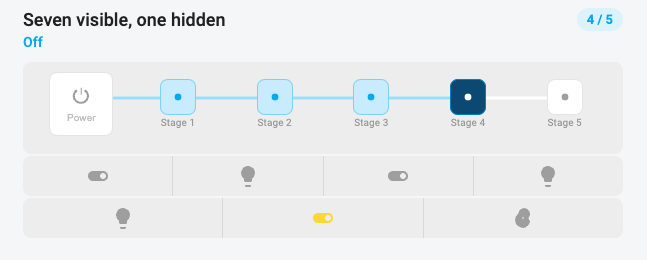

# Hass Scene Studio



Hass Scene Studio is a Home Assistant Lovelace frontend for **scene-sets**: small bundles of exclusive [scenes](https://www.home-assistant.io/integrations/scene/) that remotes, dashboards, and automations call with `scene.turn_on`.

The plugin is one JavaScript module (`hass-scene-studio.js`) for [HACS](https://hacs.xyz/). It is **not** a Home Assistant add-on. After the resource loads, Scene Studio appears under **Settings → Dashboards** and can be shown in the sidebar.

In the card picker the package registers, in this order:

| Picker name | Lovelace type | Role |
| --- | --- | --- |
| **Scene Studio - Scene-set** | `custom:scene-studio-card` | Bind a scene-set to a room dashboard |
| **Scene Studio - Room Lights: Mini** | `custom:scene-studio-room-lights-mini-card` | Compact RGB / Warm / White control |
| **Scene Studio - Room Lights: Advanced** | `custom:scene-studio-room-lights-card` | Full RGB / Warm / White control |
| **Scene Studio - Room Switches** | `custom:scene-studio-room-switches-card` | Staged on/off control |

Scene-set cards fill themselves from the scenes you saved in Scene Studio. The Room Lights and Room Switches cards can also be configured by hand with helpers if you are not using a scene-set.

- [Install](#install)
- [Open Scene Studio](#open-scene-studio)
- [Scene-sets](#scene-sets)
- [Wizard](#wizard)
- [Live edit](#live-edit)
- [Dashboard cards](#dashboard-cards)
- [Automations and remotes](#automations-and-remotes)
- [Manual helper cards](#manual-helper-cards)
- [Development](#development)

## Install

### HACS (recommended)

1. Install [HACS](https://hacs.xyz/docs/setup/download) if needed.
2. Open **HACS → Frontend**.
3. Three-dot menu → **Custom repositories**.
4. Add `https://github.com/raj47i/hass-staged-switch` and set the type to **Lovelace** / **Dashboard**.
5. Install **Hass Scene Studio**.
6. Reload Lovelace resources (or restart Home Assistant) and refresh the browser.

HACS downloads `hass-scene-studio.js` from the GitHub release.

### Manual

1. Copy `hass-scene-studio.js` from a GitHub release (or `dist/` after `npm run build`) into `config/www/`.
2. Add a dashboard resource:
   - URL: `/local/hass-scene-studio.js`
   - Type: **JavaScript Module**

```yaml
resources:
  - url: /local/hass-scene-studio.js
    type: module
```

While testing from this repo, use `npm run deploy` and point the resource at `/local/scene-studio-loader.js`. That loader reads a version stamp so a browser refresh is enough after each deploy.

Older dashboards that still load `staged-switch-card.js` or the previous card types keep working. `npm run migrate-ha` rewrites Lovelace **card types and resource URLs only**. It does not rename Home Assistant scenes (`ssl_`, `ssm_`, `sst_`, `sla_`).

## Open Scene Studio

After the JavaScript resource is loaded, Home Assistant creates a **Scene Studio** dashboard (`/scene-studio`). Open it from the sidebar or **Settings → Dashboards**. The same **Show in sidebar** checkbox is on the Scene Studio home page and in Settings → Dashboards.

The home page lists every scene-set and offers four create buttons:

| Kind | Label | Typical use |
| --- | --- | --- |
| Lights | **Lights scene-set : Simple** | RGB + Warm + White groups |
| Lights | **Lights scene-set : Minimal** | RGB + one Whites group |
| Lights | **Lights scene-set : Advanced** | Custom overlapping groups and extra looks |
| Switches | **Switches scene-set** | Fans, heaters, and other on/off devices |

Deleting a set asks for a delayed confirm (~800 ms) and then removes every Home Assistant scene in that set. Other slugs are left alone.

## Scene-sets

A scene-set is **not** a Home Assistant group. It is several real scenes that belong together. Only one look is meant to be on at a time. Tapping a look on the card calls `scene.turn_on` for that scene.

Each set always starts with **Off / Default**: every member off. The other scenes are exclusive looks (RGB, Warm Min, a custom Movie look, and so on).

### Shared rules

- **Lights first, then switches.** A lights set can include `light` and `switch` entities. Color lights can belong to RGB and also to Warm or White.
- **Add from an area or a device.** The picker adds every matching light and switch under that area or device. The same entity can sit in more than one group.
- **Names come from Home Assistant.** Chip and review labels use the live friendly name.
- **Brightness is 1–100%.** Off is a separate scene, never 0% brightness.
- **New sets start all-off.** The first time stages are saved, every entity in every look is off until you live-edit. Existing scene-sets keep the on/off values already stored in Home Assistant.
- **Membership survives offs.** Group members are stored on the scene so turning a light off in live edit does not drop it from the group on reload.
- **Scenes are written in order.** Each step of the wizard can persist. Writes are sequential so later looks are not lost if Home Assistant is slow.
- **Leftover looks are deleted** when you shrink a set (five Warm levels down to three, and so on). Growing a set does not delete anything.
- **Each step has a URL**, for example `/scene-studio/studio/new/light/name` or `/scene-studio/studio/edit/switch/patio/entities`.

### Scene id prefixes

| Kind | Prefix | Example |
| --- | --- | --- |
| Lights : Simple | `ssl_` | `scene.ssl_living_off`, `scene.ssl_living_rgb`, `scene.ssl_living_w1` |
| Lights : Minimal | `ssm_` | `scene.ssm_guest_off`, `scene.ssm_guest_t2` |
| Lights : Advanced | `sla_` | `scene.sla_movie_00`, `scene.sla_movie_01` |
| Switches | `sst_` | `scene.sst_patio_00`, `scene.sst_patio_01` |

A named set can be saved before any entities are added. That writes a stub Off scene so the slug is reserved.

### Lights scene-set : Simple

Groups:

1. **RGB** — color lights, one shared color and brightness, optional effect.
2. **Warm** — 2–5 intensity levels. Two lights allow 2–3 levels; three or more allow 2–5. Default is three: **Min / Mid / Max**. Five levels are **Min / Low / Mid / High / Max**.
3. **White** — same level counts and names as Warm.

Warm uses hex `#ff8a1d`. White uses `#ffffff`. Only members of that group change on that look; everyone else stays off.

Scene ids use the look slot: `off`, `rgb`, `w1`…`w5`, `n1`…`n5`.

Wizard steps: **Name → Entities → Groups → Live edit → Finish**.

### Lights scene-set : Minimal

Same wizard as Simple, with two groups:

1. **RGB**
2. **Whites** — 2–4 levels:
   - 2: **Min / Max** (Min is 20% warm)
   - 3: **Warm / Neutral / White** (`#ff8a1d`, `#f3eadc`, `#ffffff`)
   - 4: **Dim / Warm / Neutral / White**

Scene ids use `off`, `rgb`, `t1`…`t4`.

### Lights scene-set : Advanced

Build your own groups. Groups can overlap. Each group has editable **level names** instead of a 2–5 dropdown.

- Type names split by `|`. Default: `Min|Low|Mid|High|Max`.
- Names become an ordered list (`0` = first name, `4` = fifth). Live-edit looks stay on that index when you rename a level.
- If you change the order, looks follow the slots. That cannot be repaired afterwards.
- Shrink five names to three and the last two looks are dropped.
- Up to **7** names. An eighth name shows a warning and is ignored.
- Spaces are allowed (`Soft low`) and trimmed. Card buttons ellipsize long labels — keep names short.

You can also add **custom looks** that are not a group level (a mixed Movie look, for example). Off / Default is always first and is not live-edited.

Scene ids are numbered: `sla_{slug}_00` (Off), then `_01`, `_02`, …

Wizard steps: **Name → Entities → Groups → Live edit → Finish**.

### Switches scene-set

On/off snapshots for fans, heaters, outlets, and other toggles.

A **new** set saves every stage all-off until you turn something on in the editor. That keeps large or powerful loads off while you pick the right mix.

Existing sets that were saved as **cumulative** (stage 1 = first entity, stage 2 = first two, …) stay cumulative when you re-save. You can switch a set to an **explicit** mix if each stage needs its own on/off map.

Wizard steps: **Name → Entities → Scenes → Finish**.

Scene ids are numbered: `sst_{slug}_00` (Off), then `_01`, `_02`, …

## Wizard

Every kind starts on **Name** so the set can be saved at once. The slug becomes the scene id prefix. After that:

| Step | Lights (all three) | Switches |
| --- | --- | --- |
| Entities | Add lights and switches. Area and device pickers available. | Same, on/off entities. |
| Groups | Assign members to RGB / Warm / White, or custom Advanced groups. | — |
| Scenes | — | Name stages and set on/off (new sets start off). |
| Live edit | Tap a look, change members, Save. | — |
| Finish | Review the exclusive scenes. | Review. |

Leaving a step writes the current scenes. You can close the browser and reopen the set from the home list.

## Live edit

Live edit loads the **saved scene**, not a guessed default.

1. The card (and the editor preview) turns **Off / Default** first, waits **0.5 s**, then applies the look. Going to Off skips the wait.
2. **RGB color and brightness tweaks** on an already-on RGB look skip the Off flash so the lights do not blink.
3. **Cancel** reloads the last saved scene. **Save** writes that look.
4. Off / Default is listed first and stays out of the live-edit list — it is always all off.
5. Only group members can turn on in that look. A Warm-only light cannot be forced on in the RGB scene.

On first load, dashboard cards infer the current look from the live lights when they can, even if this browser last saved a different row.

## Dashboard cards

### Scene Studio - Scene-set

Add this on a room dashboard and pick a scene-set. The card becomes:

- **Room Lights: Mini** for Lights : Simple and Lights : Minimal
- **Room Switches** for Switches and Lights : Advanced

The heading defaults to the scene-set name (a trailing “lights” / “switches” is stripped). In the card editor you can change the title, clear it to hide the heading, and align it **Left / Middle / Right**. Alignment is disabled when the title is empty.

**Show entity buttons** is off unless you turn it on. Existing cards that never stored the option stay unchecked. When it is on, every entity in the set is listed under the controls — including members that are not in a group. New entities added later start visible. Uncheck one to hide its button. Buttons wrap in even rows (at most 6 per row).

```yaml
type: custom:scene-studio-card
studio: guest_room
title: Guest Room
title_align: center
show_switches: true
hidden_entities:
  - light.guest_spare
```

| Option | Type | Default | Description |
| --- | --- | --- | --- |
| `type` | string | | `custom:scene-studio-card` |
| `studio` | string | | Scene-set slug. Empty shows every set’s control |
| `title` | string | scene-set name | Heading. Clear it to hide |
| `title_align` | string | `left` | `left`, `center` (`middle`), or `right` |
| `show_switches` | boolean | off | Show entity buttons under the control |
| `hidden_entities` | list | | Entity ids hidden when `show_switches` is on |

You can add Room Lights: Mini or Room Switches yourself and set the same `studio` slug. The card still fills rows and stages from those scenes — no helpers required.

### Scene Studio - Room Lights: Mini

Two rows:

1. **Mode** — RGB, Warm, and White (only the rows you configured). Tap the active mode to turn it off; tap again or another mode to turn that one on.
2. **Controls** — RGB shows brightness (1–100%), presets, and the color picker. Warm or White shows that row’s intensity stages. While every mode is off, the last mode’s controls stay visible but greyed out.

On a scene-set card, **Show entity buttons** is available and off until you enable it. A mini card configured only with helpers has no chip option.

```yaml
type: custom:scene-studio-room-lights-mini-card
studio: guest_room
title: Guest Room
title_align: left
```

### Scene Studio - Room Lights: Advanced

The same RGB / Warm / White lighting as three exclusive rows. Used as a **manual** card with an `input_text` helper, or bound with `studio:` to a Simple/Minimal set if you want the full row layout instead of Mini.

Only one of RGB, Warm, or White can be on. Entity chips stay hidden unless **Show entity buttons** is on; then they sit together at the bottom.

### Scene Studio - Room Switches

Staged Power + look buttons. Bound to a Switches or Advanced lights scene-set, or configured by hand with an `input_number` helper (see [Manual helper cards](#manual-helper-cards)).

Taps on a scene-set card call `scene.turn_on`. The leftmost **Power** button is Off / Default.

## Automations and remotes

Scene-sets are ordinary Home Assistant scenes. Point a Pico, Hue button, or automation at a scene id:

```yaml
action: scene.turn_on
target:
  entity_id: scene.ssl_living_w2
```

Do not wrap the set in a group. Each look is already exclusive.

## Manual helper cards

These cards still work without Scene Studio. Use them when you want the control but not Home Assistant scenes.

### Room Switches with a helper

You need the plugin, an `input_number` for the current stage, and the entities to combine.

Create the helper under **Settings → Devices & services → Helpers → Create helper → Number**. Set `min` to `0`, `step` to `1`, and `max` to the last stage index. The card shows at most **5 stages besides Power**. Extra entities can still appear as chips.

For three devices in cumulative mode there are **four** helper values (Off plus one per device), so `max` is `3`:

```yaml
input_number:
  patio_stage:
    name: Patio stage
    min: 0
    max: 3
    step: 1
    mode: slider
```

| Helper value | Meaning in cumulative mode |
| --- | --- |
| `0` | Everything off |
| `1` | First entity on |
| `2` | First two entities on |
| `3` | All listed entities on |

If `min` is not `0`, the card still maps stage buttons onto that range when it writes `input_number.set_value`.

The editor accepts `switch`, `light`, `fan`, and `input_boolean` entities that have On/Off. Sensors, diagnostics, and hidden or disabled entities are skipped.

#### Cumulative: stack entities in order

List entities in the order they should come on. Stage `0` turns all of them off. Each higher stage turns on one more entity and leaves the earlier ones on.

```yaml
type: custom:scene-studio-room-switches-card
title: Patio
entity: input_number.patio_stage
power_entity: input_boolean.patio_power
stage_names:
  - Off
  - Fan
  - String lights
  - Heater
switches:
  - entity: switch.patio_fan
    name: Fan
  - entity: light.patio_string
    name: String lights
  - entity: switch.patio_heater
    name: Heater
```

| Stage | Label | Fan | String lights | Heater |
| --- | --- | --- | --- | --- |
| 0 | Off | off | off | off |
| 1 | Fan | on | off | off |
| 2 | String lights | on | on | off |
| 3 | Heater | on | on | on |

Stage names are independent of the entities. A switch `name` is only the entity button tooltip.

Shorthand:

```yaml
type: custom:scene-studio-room-switches-card
entity: input_number.patio_stage
switches:
  - switch.patio_fan
  - light.patio_string
  - switch.patio_heater
```

You can list more than five entities. The card still shows only five stage buttons; extra entities stay available as chips and are included when Power turns everything off.

#### Explicit: any on/off mix per stage

```yaml
type: custom:scene-studio-room-switches-card
title: Living room
entity: input_number.living_scene
stages:
  - name: All off
    switches:
      light.sofa: off
      light.reading: off
      light.cabinet: off
      switch.soundbar: off
  - name: Reading
    switches:
      light.sofa: off
      light.reading: on
      light.cabinet: off
      switch.soundbar: off
  - name: Movie
    switches:
      light.sofa: off
      light.reading: off
      light.cabinet: on
      switch.soundbar: on
```

You can write each stage as a list instead of a map. List every entity you care about on **every** stage. Roster entities omitted from a stage are turned off. Power off also turns every card entity off, including hidden chips.

If both `stages` and `switches` are set, `stages` wins for the stage map. `switches` is still used for chip order, names, and `hide`.

One card is one combination (one helper, one set of entities). For two rooms, add two helpers and two cards. Give each card its own `input_number`.

A single combination can mix domains. The card calls `homeassistant.turn_on` / `turn_off` on whatever you list.

If automations already listen to the helper, keep the stage control on the card but do not let the card touch the entities:

```yaml
type: custom:scene-studio-room-switches-card
title: Irrigation
entity: input_number.irrigation_zone
direct_control: false
stages:
  - name: Idle
  - name: Front lawn
  - name: Beds
  - name: Drip
```

#### Visual editor

1. Add **Scene Studio - Room Switches**, or click **Edit** on an existing card.
2. Set the title, the `input_number` stage helper, and an optional `input_boolean` power helper.
3. On **1. Entities**, add lights, fans, and switches. Pick an area or a device to add every matching On/Off entity under it.
4. Use **Hide from card** if a relay should follow the stages but not show as a chip.
5. On **2. Stages**, choose **Cumulative switches** or **Explicit stage map**.
6. Edit **Stage names**. The Power button label is always **Power**.
7. In explicit mode, set each row to **On** or **Off**.
8. Use the checkboxes to show or hide entity buttons and stage labels, or to disable direct switch control.

#### Room Switches options

| Option | Type | Required | Default | Description |
| --- | --- | --- | --- | --- |
| `type` | string | yes | | `custom:scene-studio-room-switches-card` |
| `title` | string | no | `Room Switches` | Card heading. Clear it to hide |
| `title_align` | string | no | `left` | `left`, `center`, or `right` |
| `entity` | string | recommended | | `input_number` for the current stage |
| `power_entity` | string | no | | Optional `input_boolean` for group on/off |
| `switches` | list | no | | Entities in order. Stage `0` is all off |
| `stages` | list | no | | Explicit per-stage on/off map |
| `stage_names` | list | no | | Labels (index `0` is Off) |
| `studio` | string | no | | Scene-set slug. Stages come from that set |
| `direct_control` | boolean | no | `true` | `false`: only update helpers |
| `show_switches` | boolean | no | `true` | Show a chip per visible entity. Scene-set cards default this to off |
| `hidden_entities` | list | no | | Entity ids hidden from the chip row |
| `show_stage_labels` | boolean | no | `true` | Muted names under the buttons |

Provide at least one of `entity`, `switches`, or `stages`. Limits: **5 stages** besides Power, on one row. **6 entity chips** per row; extras wrap and are split evenly (7 → 4+3).

`switches` item:

```yaml
- entity: switch.patio_fan   # required
  name: Fan                  # optional chip tooltip
  icon: mdi:fan              # optional
  hide: true                 # still controlled, not shown
```

Or just `switch.patio_fan`.

`stages` item:

```yaml
- name: Evening
  switches:
    light.sofa: on
    switch.soundbar: on
```

#### How the control behaves

1. **Power** turns the group on or off. Off turns every card entity off and leaves the last stage in the helper (and in this browser) so Power on restores that stage.
2. Only Power and the stage buttons (or their labels) change the group. Clicks on the bar around them do nothing.
3. Choosing a stage writes `input_number.set_value` (and the optional power helper), then applies that mix when `direct_control` is on. Omitted roster entities are turned off.
4. Entity chips toggle that one entity. If the new mix is not a configured stage, the progress stays put. If it matches a stage, the bar updates.
5. Chip toggles are not remembered across Power off. Memory is the last stage only.

`direct_control: false` still updates the helpers, but the card will not turn entities on or off.

### Room Lights: Advanced with a helper

Three exclusive rows, stored in **one** `input_text` as a short JSON string:

1. **RGB** — Power labeled RGB, a 1–100% brightness slider, then color presets. Only RGB-capable lights.
2. **Warm** — at least two lights or switches or the row stays hidden. Two entities allow 2–3 stages; three or more allow 2–5. Names are **Min / Low / Mid / High / Max**. Each stage is an on/off mix.
3. **White** — the same limits and names.

```yaml
input_text:
  living_lights:
    name: Living lights
    max: 255
```

```yaml
type: custom:scene-studio-room-lights-card
entity: input_text.living_lights
rgb:
  - light.sofa_rgb
  - light.cabinet_rgb
warm:
  - light.floor_lamp
  - light.reading
white:
  - light.ceiling
  - light.desk
```

If you omit `warm_stages` / `white_stages`, each intensity is cumulative. The editor writes the maps so you can flip any light on or off per stage. Two lights default to Min / Mid / Max. Three or more default to all five names.

The stored payload looks like `{"r":{"o":1,"b":180,"c":"#ff8a1d"},"w":{"o":0,"s":2},"n":{"o":0,"s":1},"l":"r"}`. `l` is the last RGB / Warm / White mode. If the helper is missing, the card still remembers the last values in this browser.

Power off keeps the last row, RGB brightness and color, and Warm/White intensity. Turning that row back on restores it and turns the other two rows off.

RGB, Warm, and White always turn their lights on and off. **Show entity buttons** is off by default.

| Option | Type | Required | Description |
| --- | --- | --- | --- |
| `type` | string | yes | `custom:scene-studio-room-lights-card` |
| `title` | string | no | Heading. Clear it to hide |
| `title_align` | string | no | `left`, `center`, or `right` |
| `studio` | string | no | Scene-set slug. Rows and stages come from that set |
| `entity` | string | recommended | `input_text` that stores the JSON state |
| `stages` | number | no | Fallback stage count when a row has no map yet |
| `rgb` | list | no | RGB-capable lights |
| `warm` | list | no | Lights or switches. Hidden with fewer than 2 |
| `white` | list | no | Lights or switches. Hidden with fewer than 2 |
| `warm_stages` | list | no | Per-intensity on/off map (2–5) |
| `white_stages` | list | no | Independent of Warm |
| `rgb_presets` | list | no | Hex swatches. Defaults to the built-in 8 colors |
| `rgb_icons` | map | no | `{ on, off }` MDI icons for the RGB power button |
| `warm_icons` | map | no | `{ on, off }` for Warm |
| `white_icons` | map | no | `{ on, off }` for White |
| `show_switches` | boolean | no | Default `false`. Show every entity once at the bottom |
| `hidden_entities` | list | no | Hidden when `show_switches` is on |

RGB items must be color lights. Warm/White items are a light or switch id, or `{ entity, name, icon, hide }`.

### Room Lights: Mini with a helper

Point it at the same `input_text` as the Advanced lights card if you want both layouts for one room.

```yaml
type: custom:scene-studio-room-lights-mini-card
entity: input_text.living_lights
rgb:
  - light.sofa_rgb
warm:
  - light.floor_lamp
  - light.reading
```

The editor is the same multipage RGB / Warm / White setup as Room Lights: Advanced.

## Development

```bash
npm install
npm test
npm run build
npm run watch
npm run preview
npm run deploy
```

`npm test` runs the unit tests. `npm run watch` rebuilds `dist/hass-scene-studio.js`. `npm run preview` serves this folder at [http://localhost:4173](http://localhost:4173). Open `preview.html` for the dashboard cards, or `studio.html` for Scene Studio (scenes are mocked in the browser). `npm run deploy` copies the bundle to Home Assistant at `ha:/config/www/` under both the current names and the previous `staged-switch-*` filenames.

Layout:

- `src/shared/` — helpers reused by every card
- `src/cards/staged-switch/` — Room Switches
- `src/cards/staged-lights/` — Room Lights: Advanced
- `src/cards/staged-lights-mini/` — Room Lights: Mini
- `src/studio/` — Scene Studio editor and Scene-set card
- `src/index.ts` — bundle entry

Requirements: Node.js 20 or newer.

### Publishing a HACS release

HACS loads `hass-scene-studio.js` from GitHub release assets (`hacs.json`).

1. Update `version` in `package.json` and `PACKAGE_VERSION` in `src/shared/const.ts`.
2. Commit and tag, for example `v0.0.8-beta`.
3. Push the tag. The release workflow builds the bundle and attaches `hass-scene-studio.js`.

## License

Copyright (C) 2026 raj47i

This project is free software under the [GNU General Public License v3.0 or later](LICENSE).

You can use, share, and change it. A note or thanks is enough if you just use it. If you publish a modified version or something based on this card, you must also release that work as open source under the same license and provide the source. See the [GNU GPL](https://www.gnu.org/licenses/gpl-3.0.html) for the full terms.
